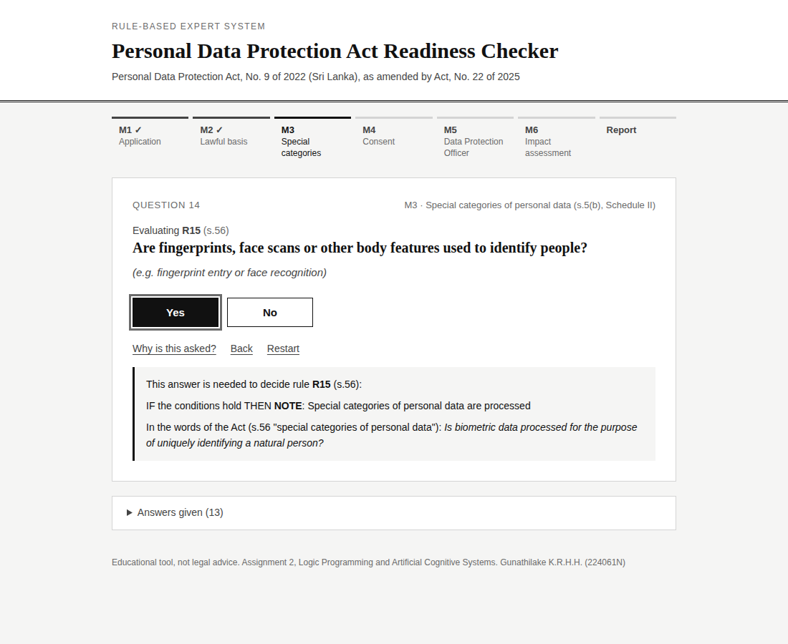
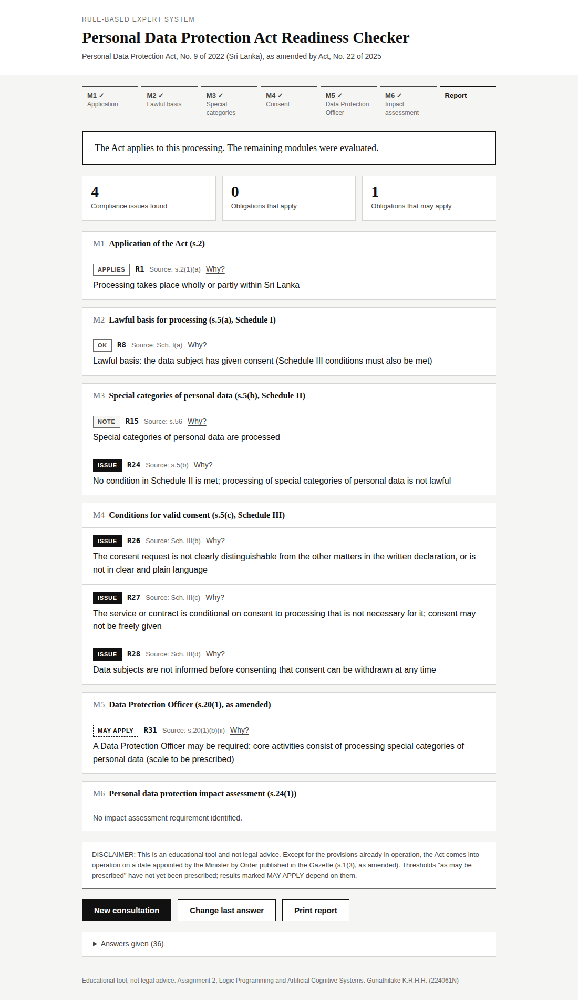
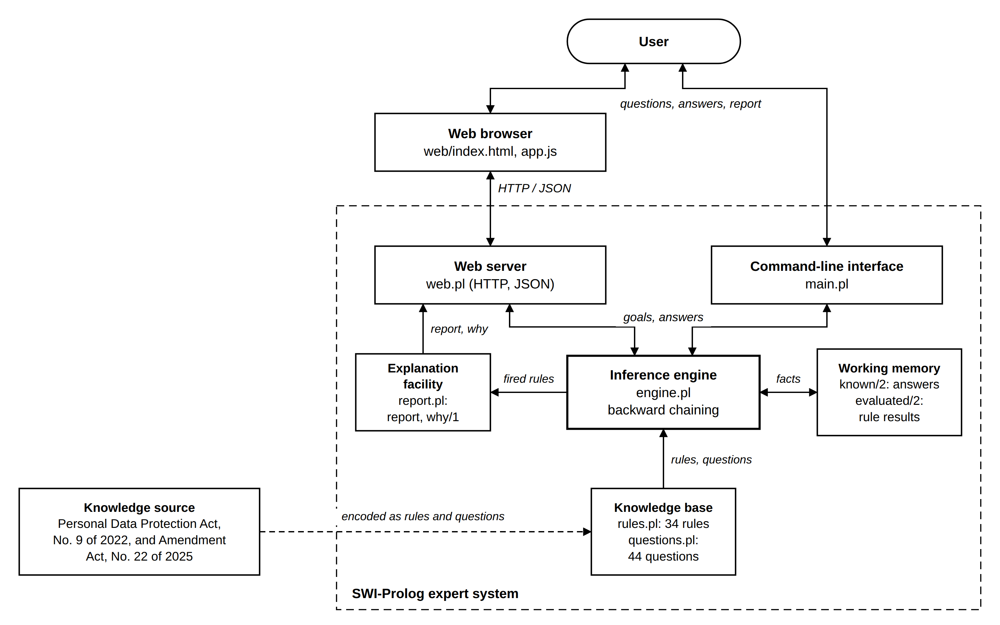
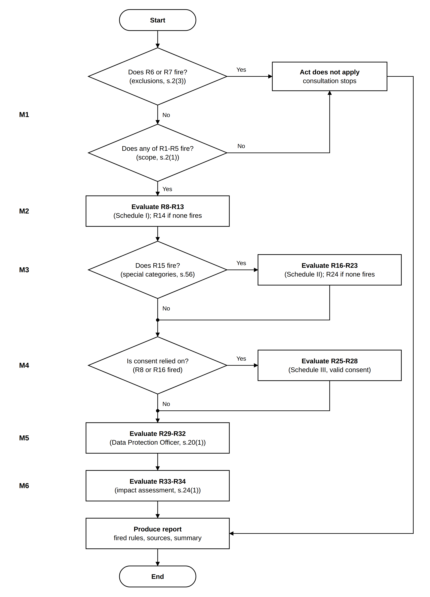
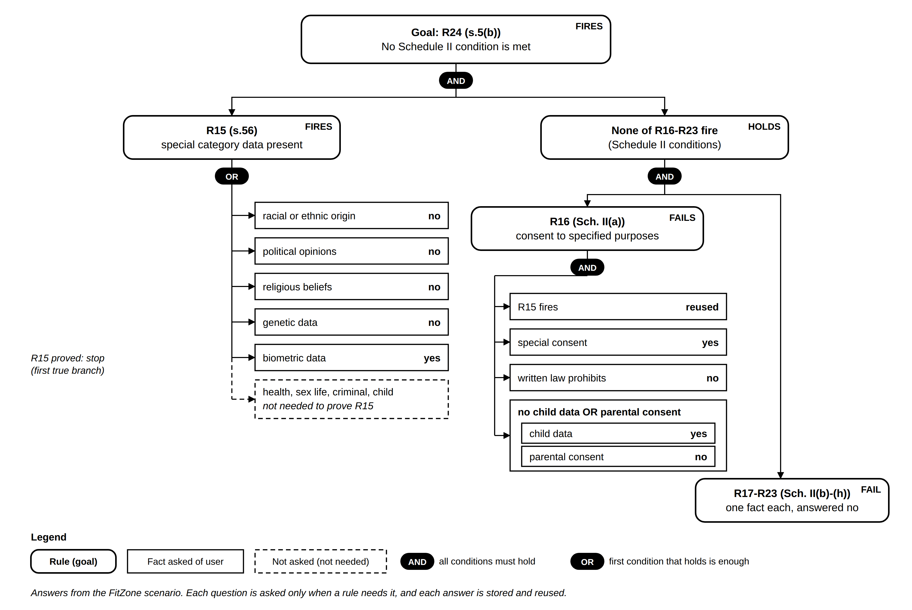

# Personal Data Protection Act Readiness Checker: A Rule-Based Expert System

A rule-based expert system, written in SWI-Prolog, that checks how ready an
organisation is for Sri Lanka's **Personal Data Protection Act, No. 9 of 2022**,
as amended by the **Personal Data Protection (Amendment) Act, No. 22 of 2025**.

The user answers yes/no questions about how the organisation processes
personal data. The system then reports:

- whether the Act applies (s.2),
- which lawful basis the processing relies on (s.5(a), Schedule I),
- whether special categories of personal data are processed lawfully (s.5(b), Schedule II),
- whether consent meets the conditions for valid consent (s.5(c), Schedule III),
- whether a Data Protection Officer is or may be required (s.20(1), as amended),
- whether a personal data protection impact assessment is required (s.24(1)).

Every conclusion is shown with the rule that produced it and the section of the
Act it comes from.

> **Disclaimer:** This is an educational tool and not legal advice. Except for
> the provisions already in operation, the Act comes into operation on a date
> appointed by the Minister by Order published in the Gazette (s.1(3), as amended).

Assignment 2: Logic Programming and Artificial Cognitive Systems.
Gunathilake K.R.H.H. (224061N)

---

## 1. Requirements

**SWI-Prolog** version 9 or later (tested with 9.0.4). It is free and runs on
Windows, macOS and Linux. No other software or internet connection is needed.

| System | How to install |
|---|---|
| Windows | Download and run the installer from <https://www.swi-prolog.org/download/stable>. When asked, choose **"Add swipl to the system PATH"**. |
| macOS | Download the `.dmg` from <https://www.swi-prolog.org/download/stable>, or run `brew install swi-prolog`. |
| Ubuntu / Debian | `sudo apt install swi-prolog` |

Check the installation by opening a terminal (Command Prompt or PowerShell on
Windows) and running:

```
swipl --version
```

## 2. Get the code

Either clone the repository:

```
git clone https://github.com/HashiruG/Personal-Data-Protection-Rediness-Expert-System.git
cd Personal-Data-Protection-Rediness-Expert-System
```

or download the `.zip` file, extract it, and open a terminal in the extracted folder.

## 3. Run the expert system

The system has two interfaces that use the same knowledge base and inference
engine: a **web interface** in the browser, and a **command-line interface** in
the terminal. Both run entirely on the local machine.

From the project folder, load the system:

```
swipl main.pl
```

### 3.1 Web interface

At the Prolog prompt, start the web server:

```prolog
?- server.
```

Then open <http://localhost:8080> in a web browser and click **Begin
consultation**.

- Answer each question with **Yes** or **No** (keyboard: <kbd>Y</kbd> / <kbd>N</kbd>).
- **Why is this asked?** (<kbd>W</kbd>) shows the rule being evaluated and its source in the Act.
- **Back** (<kbd>B</kbd>) returns to the previous question; **Restart** starts again.
- The report lists every rule that fired, grouped by module. **Why?** next to a
  rule shows its conditions and the answers that made it fire.
- Answers are kept if the page is reloaded.

Keep the Prolog window open while using the browser. To stop the server, type
`stop_server.` or `halt.` at the Prolog prompt. If port 8080 is already in use,
start the server on another port, e.g. `server(8081).`, and open
<http://localhost:8081>.

### 3.2 Command-line interface

At the Prolog prompt, start a consultation:

```prolog
?- start.
```

Then answer each question:

| Type | Meaning |
|---|---|
| `yes` or `y` | the condition holds |
| `no` or `n` | the condition does not hold |
| `why` | show which rule the question is needed for, and its source in the Act |
| `quit` | stop the consultation |

A full stop after the answer is optional. When all the necessary questions have
been answered, the report is printed.

After the report, any rule can be explained, showing its conditions and the
answers given:

```prolog
?- why(r24).
```

To exit Prolog:

```prolog
?- halt.
```

**Windows without a terminal:** open **SWI-Prolog** from the Start menu, choose
**File > Consult...**, select `main.pl`, then type `server.` or `start.` at the
prompt.

## 4. Run the tests

```
swipl main.pl
```

```prolog
?- run_all_tests.
```

or, in one command from the terminal:

```
swipl -g run_all_tests -t halt main.pl
```

This runs:

1. **Nine scenarios** through the whole consultation with preset answers,
   comparing the rules that fire with the expected rules;
2. **A unit test for each of the 34 rules**, checking that the rule fires when
   its conditions hold.

Expected result:

```
9 of 9 scenarios passed.
Rules fired in at least one scenario: 20 of 34.
Rule unit tests: 34 of 34 rules fire when their conditions hold.
```

| # | Scenario | Rules expected to fire |
|---|---|---|
| 1 | Individual keeping family contacts | R6 |
| 2 | FitZone gym, Colombo (members aged 14-15) | R1, R8, R15, R24, R26, R27, R28, R31 |
| 3 | Online shop (contract, no special data, no profiling) | R1, R9 |
| 4 | Government department | R1, R10, R12, R29 |
| 5 | Overseas lender profiling for credit decisions | R5, R13, R33 |
| 6 | Public corporation (no DPO under s.20(1)(a) as amended) | R1, R10 |
| 7 | Anonymous statistics only (no personal data) | R7 |
| 8 | Marketing list with no lawful basis | R1, R14 |
| 9 | Private hospital with CCTV covering a public road | R1, R9, R15, R22, R31, R34 |

## 5. Sample session

A gym in Colombo registers members aged 14-15 using fingerprint entry, keeps
injury records, uses a single "I agree" box on its membership form, refuses
membership without fingerprints and does not tell members they can withdraw
consent.

**Web interface:** a question with its explanation, and the final report.





**Command-line interface:** part of the session:

```
Q14 [M3, R15] Is biometric data processed for the purpose of uniquely
  identifying a natural person (for example fingerprints or facial
  recognition)?
  (yes / no / why) > why
  This answer is needed to decide rule R15 (s.56):
    IF the conditions hold THEN NOTE: Special categories of personal data
      are processed
  Source of this question in the Act: s.56 "special categories of personal
    data"
  (yes / no / why) > yes
```

Part of the report:

```
M3  Special categories of personal data (s.5(b), Schedule II)
----------------------------------------------------------------------------
  [R15] NOTE: Special categories of personal data are processed
    Source: s.56
  [R24] ISSUE: No condition in Schedule II is met; processing of special
    categories of personal data is not lawful
    Source: s.5(b)

M4  Conditions for valid consent (s.5(c), Schedule III)
----------------------------------------------------------------------------
  [R26] ISSUE: The consent request is not clearly distinguishable from the
    other matters in the written declaration, or is not in clear and plain
    language
    Source: Sch. III(b)
  [R27] ISSUE: The service or contract is conditional on consent to
    processing that is not necessary for it; consent may not be freely given
    Source: Sch. III(c)
  [R28] ISSUE: Data subjects are not informed before consenting that consent
    can be withdrawn at any time
    Source: Sch. III(d)
```

The complete session, including the full report and `why(r16)`, is in
[`docs/sample-session-fitzone.txt`](docs/sample-session-fitzone.txt).

## 6. How it works

The system uses **backward chaining** (goal-driven reasoning), which is native to
Prolog. Each module is a goal. To prove a goal, the inference engine tries the
rules that conclude it and proves their conditions one by one. A condition that
is not yet known is asked of the user, and the answer is stored in working
memory, so no question is asked twice. Questions are only asked when a rule
needs them: for example, once biometric data is confirmed, rule R15 is proved
and the remaining special category questions are skipped.



The modules are proved in order:

1. **M1** Does the Act apply? If not, the consultation stops.
2. **M2** Lawful basis.
3. **M3** Special categories (Schedule II conditions only if special category data is present).
4. **M4** Valid consent (only if consent is relied on).
5. **M5** Data Protection Officer.
6. **M6** Impact assessment.
7. Report.



The goal tree below shows how rule R24 is proved for the FitZone scenario.
R15 is proved as soon as biometric data is confirmed, so the remaining special
category questions are not asked; the result of R15 is then reused by R16.



The diagram sources (SVG) are in [`docs/diagrams`](docs/diagrams).

| File | Contents |
|---|---|
| `main.pl` | Loads the system; command-line interface: `start/0`, questions on the terminal, `why` during questions |
| `web.pl` | Web server: serves the web interface and answers its requests using the inference engine |
| `web/` | Web interface page (`index.html`, `style.css`, `app.js`) |
| `rules.pl` | Knowledge base: the 34 rules, each with its source section |
| `questions.pl` | Knowledge base: the question for each fact used in the rules |
| `engine.pl` | Inference engine (backward chaining) and working memory |
| `report.pl` | Explanation facility: final report and `why/1` |
| `tests.pl` | Test scenarios and rule unit tests |

## 7. Rules

All 34 rules are taken from the Act; none were made up. No human expert was
consulted. The full rule table, with the verbatim text of each provision, is in
**Annex A** of the report.

| Module | Rules | Source |
|---|---|---|
| M1 Application of the Act | R1-R5 (Act applies), R6-R7 (Act does not apply) | s.2(1), s.2(3) |
| M2 Lawful basis | R8-R13 (Schedule I conditions), R14 (no lawful basis) | Sch. I(a)-(f), s.5(a) |
| M3 Special categories | R15 (special category data), R16-R23 (Schedule II conditions), R24 (no condition met) | s.56, Sch. II(a)-(h), s.5(b) |
| M4 Valid consent | R25-R28 | Sch. III(a)-(d) |
| M5 Data Protection Officer | R29-R32 | s.20(1)(a), (b)(i)-(iii), as amended |
| M6 Impact assessment | R33-R34 | s.24(1)(a), (b) |

## 8. Sources

1. Personal Data Protection Act, No. 9 of 2022. Parliament of the Democratic
   Socialist Republic of Sri Lanka.
   <https://www.parliament.lk/uploads/acts/gbills/english/6242.pdf>
2. Personal Data Protection (Amendment) Act, No. 22 of 2025. Parliament of the
   Democratic Socialist Republic of Sri Lanka.
   <https://www.parliament.lk/uploads/acts/gbills/english/6384.pdf>
3. Data Protection Authority of Sri Lanka. <https://www.dpa.gov.lk>

## 9. Limitations

- Most of the Act is not yet in operation; the system checks readiness.
- Some obligations depend on thresholds "as may be prescribed" or guidelines the
  Authority has not yet issued (R30-R32). These are reported as **MAY APPLY**.
- Not covered: personal data breach notification (s.23) and processing under
  s.24(1)(c), which depend on rules not yet made; cross-border data flows
  (s.26, replaced by the 2025 Amendment); data subject rights (Part II).
- Answers are yes/no; the system does not assess the quality of the evidence
  behind an answer.
